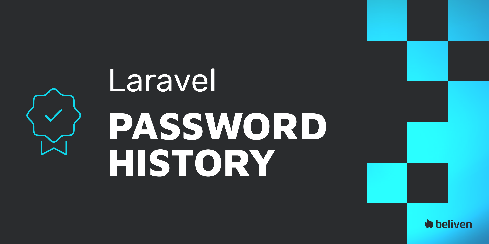

# Laravel Password History

<br>
<p align="center"></p>
<br>
    
<p align="center">

[](https://packagist.org/packages/beliven-it/laravel-password-history)
[](https://github.com/beliven-it/laravel-password-history/actions?query=workflow%3Arun-tests+branch%3Amain)
[](https://github.com/beliven-it/laravel-password-history/actions?query=workflow%3A"Fix+PHP+code+style+issues"+branch%3Amain)
[](https://packagist.org/packages/beliven-it/laravel-password-history)

</p>

This package allows you to keep track of the last passwords used by a user.

## Installation

You can install the package via composer:

```bash
composer require beliven-it/laravel-password-history
```

You can publish and run the migrations with:

```bash
php artisan vendor:publish --tag="password-history-migrations"
php artisan migrate
```

You can publish the config file with:

```bash
php artisan vendor:publish --tag="password-history-config"
```

This is the contents of the published config file:

```php
return [
    // Use -1 for unlimited history
    'depth' => (int) env('PASSWORD_HISTORY_DEPTH', 10),
];
```

The only value configurable is the depth of the password history. This value is the number of passwords that will be stored in the history. When a user tries to set a password that is in the history, the validation will fail.

## Usage

The library allow to apply a trait in your own models.

Let's try to use in the `User` model:

```php
<?php

namespace App\Models;

use Beliven\PasswordHistory\Traits\HasPasswordHistory;

class User extends Authenticatable
{
    use HasPasswordHistory;
    // ... other code
}
```

Now, when you need to create / update a user password you can use the following procedure:

```php
$user->password = $password_from_request;
$user->save();
```

You can also use a rule in your request validation:

```php
<?php

namespace App\Http\Requests\Auth;
use Illuminate\Foundation\Http\FormRequest;
use Illuminate\Validation\Rules\Password;
use Beliven\PasswordHistory\Rules\HasPasswordInHistory;

class UpdatePasswordRequest extends FormRequest
{
    /**
     * Determine if the user is authorized to make this request.
     */
    public function authorize(): bool
    {
        return true;
    }

    /**
     * Get the validation rules that apply to the request.
     */
    public function rules(): array
    {
        return [
            'password_current' => 'required|current_password:api|max:100',
            'password'         => [
                'required',
                'confirmed',
                'string',
                Password::min(8)
                    ->mixedCase()
                    ->numbers()
                    ->symbols()
                    ->uncompromised(),
                new HasPasswordInHistory($this->user()),
            ],
        ];
    }
}
```

> **Warning!!**:
>
> For password checking is important to **provide the plain text password** and **NOT the hashed password**.
> otherwise an exception will be thrown. 
> Make sure to check your code before using this package.

```php
<?php

# Allowed
$user->password = 'password';

# Not allowed
$user->password = Hash::make('password');

# This throw an exception of type PasswordAlreadyHashedException
```

## Testing

```bash
composer test
```

## Changelog

Please see [CHANGELOG](CHANGELOG.md) for more information on what has changed recently.

## Contributing

Please see [CONTRIBUTING](https://github.com/beliven-it/.github/blob/main/CONTRIBUTING.md) for details.

## Security Vulnerabilities

Please review [our security policy](https://github.com/beliven-it/.github/blob/main/SECURITY.md) on how to report security vulnerabilities.

## Credits

- [Fabrizio Gortani](https://github.com/beliven-it)
- [All Contributors](../../contributors)

## License

The MIT License (MIT). Please see [License File](LICENSE.md) for more information.
